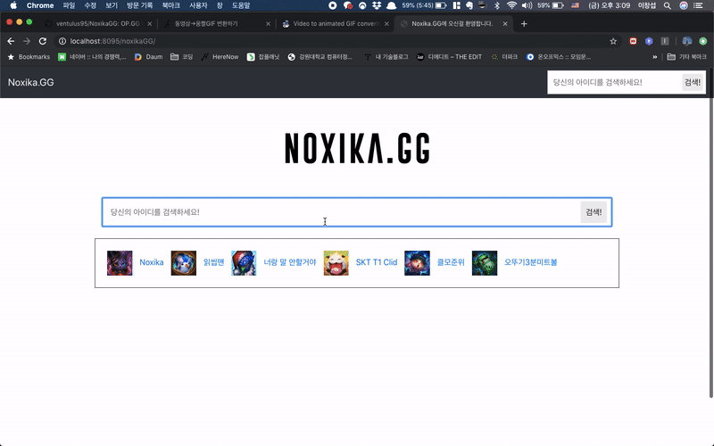
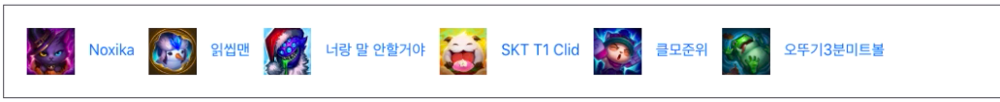
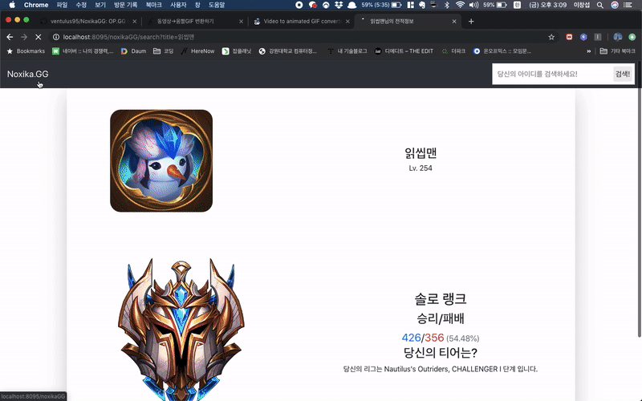

# NoxikaGG
## OP.GG Clone Coding 클론코딩 프로젝트

----

#### 본 프로젝트는 라이엇 api를 이용하여 전적검색 프로그램을 만들어본 프로젝트입니다.

일단 기본적으로  OP.GG를 모방해서 만든 프로그램입니다. 즉, 클론코딩을 해본 프로젝트입니다.

### 기능설명

1. 라이엇 API를 통해 내 아이디를 검색 해보는 기능.
  > 여기에는 자신의 랭크 티어와 I~IV까지를 알려주며, 자신이 속한 그룹명도 알려줍니다.  
  > 또한 자신이 사용하고 있는 아이콘 사진과, 레벨을 알려줍니다.  
  > 랭크는 자유랭크, 일반랭크, 전략적 팀전투까지 알려줍니다.  
  > 승리 횟수와 패배 횟수도 알려주며 그에 따른 승률도 간략하게 표시됩니다.   

  
  
2. mysql을 활용해서 검색 기록을 수집합니다.
  > 자신이 최근에 검색했던 순서대로 노출이됩니다. 
  
  이후 검색후 로그에 추가가됩니다.
  
  
  > 남아있는 아이디를 클릭해서 바로 아이디를 검색할 수 있습니다.
  

#### 현재 이 프로젝트는 기능구현과 약간의 디자인 상태로 완료한 프로젝트입니다.

**더이상의 추가 컨텐츠는 없을 상태입니다.** 지금 Spring의 중요기능들을 재대로 사용하지 못해서 리팩토링하는 것보다 아예 스프링의 기능을 재대로 활용해서 다시 구현하는게 더 나은것 같아 새로 다시 짜볼까 생각중입니다.

사용한 기능으로는 Spring과 톰캣으로 구현했습니다.

제블로그에 구현해갔던 과정이 있습니다. 한번 참조해보셔도 좋을것 같네요.

----

[블로그 프로젝트 구현과정](https://sundries-in-myidea.tistory.com/category/%ED%94%84%EB%A1%9C%EC%A0%9D%ED%8A%B8)

* [1편] (https://sundries-in-myidea.tistory.com/39?category=797831)

* [2편] (https://sundries-in-myidea.tistory.com/40?category=797831)

* [3편] (https://sundries-in-myidea.tistory.com/41?category=797831)

* [4편] (https://sundries-in-myidea.tistory.com/43?category=797831)

* [5편] (https://sundries-in-myidea.tistory.com/45?category=797831)

* [6편 (완)] (https://sundries-in-myidea.tistory.com/48?category=797831)
